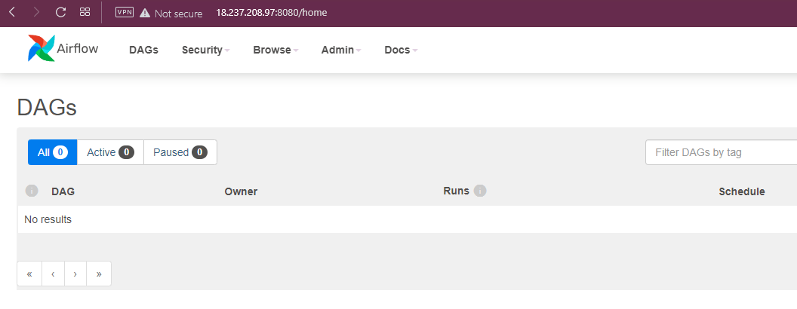
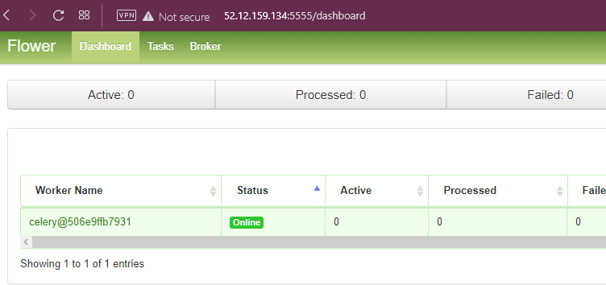
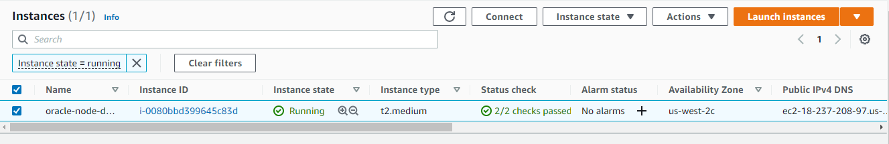

# Demo for Oracle: Simple infraestructure

## Scope

The scope for this mini project involves the creation of the Terraform code to create the required infrastructure to deploy the application "Apache Airflow" to AWS.

**Prerequisites**

- Install Terraform v1.1.3

- Generate a [public and private ssh key](https://www.cyberciti.biz/faq/how-to-set-up-ssh-keys-on-linux-unix/) with the names " dev_nodes_key.pub" and "dev_nodes_key.pem". Add the private key in the "nodes" folder and the public key in the root folder

## Instructions

1. Clone the repository
   1.1 Change the file `terraform.tfvars.example` to `terraform.tfvars` and modify the number of nodes and region to deploy the infrastructure.
2. Export the AWS credentials with the following commands:

```
export AWS_ACCESS_KEY={Your aws access key}
export AWS_SECRET_ACCESS_KEY={Your secret access key}
```

2.1 If you are using terraform cloud as backend rename the `backend.tf.example` file to `backend.tf` and set up the configuration.

3 In the root folder run `terraform init`, this command will download all the dependencies and packages needed to create the infrastructure.

4 If the planning looks good, you can use the following command to apply the configuration:

```
terraform apply -auto-approve
```

5 The infrastructure will be created, this normally takes around 6-10 min

6 Once finished, in the outputs section you'll see a list of all the public IP addresses to connect to the servers. In this case to reach the Airflow webserver it's necessary to connect to the port 8080

```
# If fails, wait a couple of minutes, probably the service is starting
http://$PUBLIC_IP:8080
```

7 Airflow webserver up and running


7.1 Airflow flower up and running (user: airflow, pass: airflow)


7.2 AWS EC2 instance up and running


8 Finally to delete the infrastructure you can run the following command:

```
tarraform destroy -auto-approve
```
